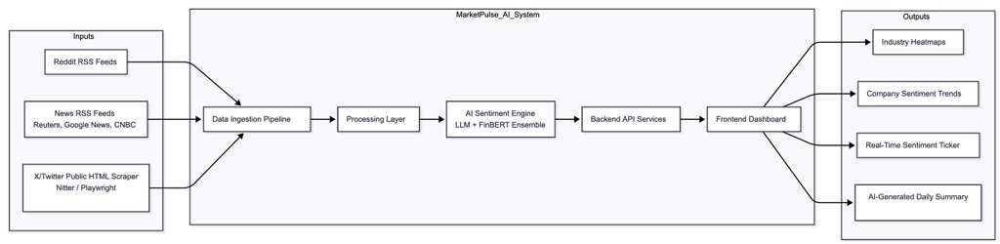
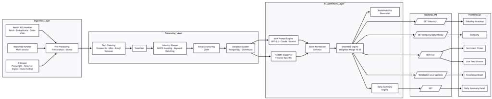
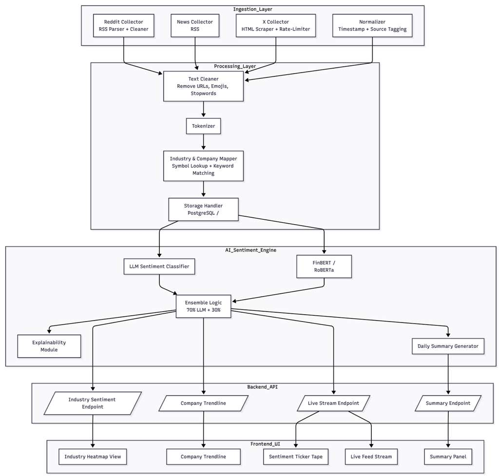

# MarketPulse AI – Final Design Report  

---

## ## Report Contents
1. Team Information, Advisor Information, and Project Abstract  
2. Project Description  
3. User Stories and Design Diagrams  
4. Project Tasks and Timeline  
   - Task List  
   - Timeline  
   - Effort Matrix  
5. ABET Concerns Essay  
6. PPT Slideshow  
7. Self‑Assessment Essays  
8. Professional Biographies  
9. Budget  
10. Appendix  

 

---

# ## 1. Project Information  

### ### Team Members  
- **Pratyush Srivastava**  
- **Sid Shah**

### ### Advisor Information  
- Prabhat Srivastava(VP Tech at Deutsche Bank)

### ### Project Abstract  
MarketPulse AI is a real‑time sentiment intelligence platform that aggregates financial news, Reddit discussions, and public X/Twitter-mirror posts. Using an ensemble of LLM and FinBERT scoring, the system converts raw text streams into industry heatmaps, company trendlines, and AI‑generated summaries. The platform is built for clarity, speed, and insight consistency while remaining fully cloud‑deployable and scalable.

 

---

# ## 2. Project Description  

### ### Team Name: MarketPulse AI  
### ### Project Topic Area  
MarketPulse AI is a multi‑layered market analytics platform designed to help investors, analysts, and students understand evolving market conditions using sentiment signals across industries and companies.  

The platform integrates:  
- **Multi‑source ingestion** (News RSS, Reddit, Nitter/X mirrors)  
- **AI ensemble sentiment scoring** (LLM + FinBERT)  
- **Interactive visual dashboards** (heatmaps, radar charts, time‑series graphs)  
- **Real‑time streaming** of new financial sentiment signals  
- **Explainability outputs** to justify sentiment classification  

Our architecture incorporates Postgres (via Supabase) with materialized view analytics, a Redis caching layer, robust text normalization, and modular ingestion pipelines.

 

---

# ## 3. User Stories and Design Diagrams  

> User stories outline the functionality from the perspective of an end‑user group.

1. **As a retail investor**, I want to view real‑time industry sentiment so that I can make informed decisions about my portfolio direction.  
2. **As a market researcher**, I want comparable company trendlines so that I can analyze performance narratives across sectors.  
3. **As a student learning finance**, I want sentiment explanations so that I understand why content is classified as positive or negative.  
4. **As a dashboard user**, I want intuitive, color‑coded visualizations so that I can understand market sentiment quickly.  
5. **As a developer/maintainer**, I want structured endpoints and modular ingestion pipelines so that the system can be extended easily.

### ### Design Diagrams  

- **Level 0 DFD** – Shows raw data flowing from external sources → sentiment engine → dashboard outputs.  

- **Level 1 DFD** – Separates ingestion pipelines (Reddit, News, Nitter), preprocessing, AI scoring, and dashboards.  

- **Level 2 DFD** – Details ingestion micro‑modules, LLM classifier, FinBERT batcher, caching, database storage, and REST API routes.

 

---

# ## 4. Project Tasks and Timeline  

### ### Task List (Expanded, Finalized)
1. Research financial data sentiment tools *(Pratyush)*  
2. Define technical specs & requirements *(Both)*  
3. Build Reddit + News ingestion pipelines *(Sid)*  
4. Build Nitter/X HTML scraper *(Sid)*  
5. Create preprocessing layer (cleaning, entity mapping) *(Sid)*  
6. Implement FinBERT classifier *(Pratyush)*  
7. Implement LLM classifier with cost‑optimized prompts *(Pratyush)*  
8. Build ensemble scoring engine *(Pratyush)*  
9. Create database schema: Postgres (Supabase) *(Sid)*  
10. Implement REST API endpoints *(Pratyush)*  
11. Add Redis caching *(Sid)*  
12. Build React dashboard (heatmaps, charts) *(Pratyush)*  
13. Build real‑time sentiment stream UI *(Pratyush)*  
14. Integration testing *(Both)*  
15. Performance tuning *(Both)*  
16. Documentation & final report preparation *(Both)*  
17. Final presentation *(Both)*  

### ### Timeline  
A week‑by‑week Gantt-style timeline is included in the PDF version.

### ### Effort Matrix  
- **Pratyush Srivastava – 52 hours**  
- **Sid Shah – 49 hours**

 

---

# ## 5. ABET Concerns Essay  

MarketPulse AI considers ethical, economic, security, and social factors:  

### **Ethical:**  
We use only publicly available RSS and Nitter-mirror data and never collect user identities. Sentiment scoring includes explainability to avoid misleading conclusions.

### **Economic:**  
The project uses free-tier APIs, serverless hosting, and open-source NLP tools to keep costs $0 while maintaining strong performance.

### **Security:**  
Redis caching, input sanitization, rate limiting, and database access rules reduce risks of data leaks, tampering, and pipeline overload.

### **Social:**  
MarketPulse AI democratizes access to sentiment intelligence, benefiting students and entry‑level researchers who lack access to professional trading tools.

 

---

# ## 6. PowerPoint Slideshow  
The full presentation is submitted alongside this report. It includes:  
- Architecture breakdown  
- Demo of ingestion → sentiment engine → dashboard  
- System diagrams  
- ABET considerations  

 

---

# ## 7. Self‑Assessment Essays  

Pratyush: 

Our senior design project, MarketPulse AI, is centered on building a real-time sentiment analysis platform that combines multi-source financial data ingestion, an ensemble AI scoring engine, and an interactive analytics dashboard. From my perspective as a Computer Science student deeply interested in AI systems, data engineering, and full-stack development, this project represents the perfect intersection of my academic strengths and professional goals. It allowed me to integrate concepts from machine learning, system design, and scalable web development into a unified, end-to-end solution.

My academic coursework has played a central role in guiding my approach to the technical challenges of this project. Subjects such as Data Structures, Algorithms, Machine Learning, Web Application Development, and Database Design helped me reason through architectural tradeoffs and build efficient components. These classes prepared me for implementing the backend services, integrating machine learning models, and designing the early stages of the frontend UX. Additionally, exposure to software engineering concepts such as modular design, version control workflows, and documentation standards has been crucial as we continue to build the system incrementally.

My professional experiences have also greatly influenced my contributions so far. Through my co-op roles in AI automation, full-stack engineering, and multi-agent pipeline development, I gained hands-on experience with ingestion systems, LLM-based classification, cloud deployment, and system reliability, skills that directly transfer to our ongoing work in MarketPulse AI. For example, my work at Acuvity with classification pipelines informed the design of our ensemble sentiment engine, while my automation experience at the SBDC helped shape my understanding of stable data ingestion and error-handling strategies. These experiences have allowed me to approach the project with a production-minded perspective, even at its current developmental stage.

One of my main motivations for choosing this project is its relevance to both my personal interests and long-term career goals. I have always been fascinated by financial markets and the role sentiment plays in shaping trends. Building a platform that synthesizes real-time signals from multiple sources and translates them into actionable insights is both challenging and exciting. Even though the system is not yet complete, the progress we have made has reinforced my enthusiasm for applied AI and large-scale systems engineering.

Our approach throughout the semester has been iterative. We began by finalizing our architecture, splitting responsibilities across ingestion, AI/NLP, backend API, and dashboard components. Up to this point, I have contributed primarily to developing the LLM sentiment classifier, integrating FinBERT, designing the ensemble scoring logic, and establishing the early version of the frontend dashboard. We have also completed early ingestion prototypes and integrated basic API routes. While several components, such as full real-time streaming, advanced charts, and complete data pipelines, are still in progress, our current milestones demonstrate steady, meaningful advancement. Looking ahead, I will continue refining the AI engine, expanding the dashboard features, and working toward a cohesive, end-to-end demo for the next phase. I will measure my success by how reliably the system operates, how seamlessly components integrate, and how effectively the final product communicates insights to its users.

 
 

Sid :

Our senior design project, MarketPulse AI, is focused on developing a real-time sentiment analysis platform that aggregates data from multiple financial sources and converts it into actionable insights through AI-driven scoring and interactive dashboards. While the project is still in development, we have made strong progress in building the ingestion infrastructure and defining a scalable architecture that supports future growth. As a Computer Science student with a strong interest in backend engineering and data-driven systems, this project has provided an ideal opportunity to apply and expand my technical skills in a meaningful, real-world context.

My academic coursework has played an important role in shaping how I approach the engineering challenges within this project. Classes such as Database Design, Algorithms, Data Structures, and Software Engineering have provided me with the foundational knowledge needed to build efficient ingestion pipelines and design a robust database schema for storing and querying sentiment data. These courses helped me reason about performance tradeoffs, normalization strategies, and system modularity, skills that have directly influenced the ingestion and backend components I’ve been developing. Additional coursework in distributed systems and data processing has strengthened my understanding of reliability and throughput, which are essential for large-scale data ingestion.

My previous project and work experiences have also been highly influential in guiding my contributions. Throughout past academic and personal projects involving web applications, APIs, and analytics pipelines, I gained practical experience with structuring backend routes, optimizing data flows, and building maintainable codebases. These experiences have helped me take ownership of the ingestion system and database layer within MarketPulse AI. I drew on this background to implement early versions of our Reddit and News ingestion modules, create data cleaning utilities, and design the relational schema that will feed into the sentiment engine and dashboard. The opportunity to integrate these skills into a collaborative capstone project has been both challenging and rewarding.

My motivation for choosing this project stems from my interest in data engineering and backend development. I enjoy working on systems that transform raw information into structured, meaningful insights, and MarketPulse AI aligns perfectly with that interest. The idea of building real-time ingestion pipelines, ensuring data reliability, and supporting an AI-driven analytics engine closely aligns with the type of work I hope to pursue in the future. Even though the system is still incomplete, the progress we’ve made has strengthened my confidence in designing scalable backend components and collaborating effectively within a team.

Throughout the semester, our team has followed an iterative approach, gradually building each subsystem while refining requirements along the way. My contributions so far include implementing ingestion scripts for Reddit and News RSS feeds, designing the initial preprocessing pipeline, creating the database schema, and laying the groundwork for ClickHouse integration to support fast analytical queries. I have also worked on coordinating our task timeline and ensuring alignment between ingestion outputs and API needs. Looking ahead, I plan to continue expanding the ingestion layer, finalize our data storage logic, and support the integration of our backend with the frontend and AI engine. I will measure my progress by the reliability, accuracy, and performance of the ingestion and database systems, as well as how seamlessly they integrate with the remaining components as we move toward our final demo.

 

---

# ## 8. Professional Biographies  

### ### **Pratyush Srivastava**  
Computer Science major specializing in AI engineering, automation, and scalable data systems. Experience includes multi‑agent automation pipelines, ML‑driven classification tools, and distributed ingestion architectures.

### ### **Sid Shah**  
Software engineering student with strong experience in backend engineering, ingestion pipelines, relational/analytical databases, and data‑driven analytics infrastructure.

 

---

# ## 9. Budget  

| Item | Cost |
|------|------|
| GitHub Student Pack | Free |
| Vercel Hosting | Free |
| Render/AWS Free Tier | Free |
| LLM Credits | $20 |

**Total Project Cost: $20**  

 

---

# ## 10. Appendix  

- **GitHub Repository:** https://github.com/senior-design-psss/marketpulse
- **Effort Documentation:** Provided in the matrix above  

---

*End of Report*
